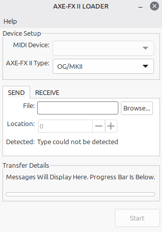

# A simple Preset/IR loader for the Axe-FX II on Linux and FreeBSD

This is a simple loading/exporting utility for the Axe-FX II. It offers both the CLI app, and a GUI using GTK3.
You do not need the CLI app to use the GUI app, they are completely separate but are built from the same back-end code.

I previously made a [GUI version of this utility in Flutter](https://github.com/M0JXD/axeii_loader), but at the moment the FlutterMidiCommand package it uses for the back-end has bugs on Linux. However I want to keep that version "as is" with the package (instead of replacing it with a FFI back-end), as there is the option of easily porting to other platforms in the future should the MIDI package be picked up and maintained again.

This repo was renamed from axeii_loader_native to axeiiloader on 14/02/26 to better reflect the binary names and the fact it no longer uses the "native wrapping" library, IUP.

## CLI usage

Without arguments, the CLI attempts to receive from the first preset location.
You must specify a file with -i to change to send mode.
If you'd prefer to set your own name for received files than the one provided by the tool, you can do so with -o.
You can get this help text by passing -h:

```
===== AXE-FX II LOADER =====
=== Axe-FX II Loader Help Text ===
The default mode is receive mode, which will save obtained files into the current directory.
If the -d option is not given it will try to autodetect from up to the first five available devices.
The unit type (-t option) does not autodetect, and transfers may fail if it's incorrect.

=== Options ===
-d <device>      The device string as appropriate for the backend, e.g. "hw:2,0" on ALSA and "/dev/umidi0.0" on OSS.
-i <file name>   Set send mode with given input file (whether it's a preset or IR will be autodetected).
-o <file name>   Override the provided file name for receive mode.
-m               Set to get IRs in receive mode (ignored for send mode).
-p <integer>     Set Preset or IR location, defaults to 0. Ignored when sending presets as they're loaded to the edit buffer.
-t <o/x/p>       Set connected unit as Original/MKII (o), XL (x) or XL Plus (p). Defaults to Original/MKII.
-h               Show this help text.
=== END OF HELP ===
```

### Examples

- Send a preset to the edit buffer, specifying an ALSA device string:
`axeiiloader -d "hw:2,0" -i mypreset.syx`

- Get a preset from location 100:
`axeiiloader -p 100`

- Send an IR to Cabinet location 15:
`axeiiloader -i myir.syx -p 15`

- Get an IR from Cabinet location 34:
`axeiiloader -m -p 34`

- Note: Scratchpad locations are just the ones after the last available slot, e.g. to send to scratchpad 2 on an OG/MKII:
`axeiiloader -i myir.syx -p 102`

  - And likewise on an XL:
`axeiiloader -i myir.syx -p 1026 -t x`

## GUI

The GUI should hopefully be quite obvious to use. Here's a screenshot:



The GUI is made using GTK3, which should integrate well with most desktop environments.
I'm waiting to see what the likes of Cinnamon and XFCE do before porting it to GTK4.

## Building

First make sure all dependencies are installed:
- ALSA on Linux (on Debian based this can be got with `sudo apt install libasound2-dev`)
- OSS on FreeBSD (comes with base)
- GTK3 if building the UI version

Then just issue `make`. The Makefile works with both GNU and BSD versions of Make, and it will build into a folder it creates called *build_dir*.
By default it will build both the CLI and GUI programs, although you can specify either `cli` or `gui` targets.

## License

The original license was MIT (which is my preference), but this had to be changed to the GPLv2.
When creating the first UI I realised I needed to get the MIDI device hardware strings/names.
One option is to call and parse `amidi -l` but that is poor and not future-proof (if the output layout changes in a future version) and parsing strings in C is a nightmare. So instead the better option is to do the RawMIDI calls that amidi itself does. To do this right I essentially refactored amidi's source to just what the -l option does. This makes my code a derivative of amidi's and hence the project license had to be updated.
An added benefit however is that the CLI version can now attempt to work out the correct device without needing to pass it.

Now that a FreeBSD OSS backend has been added, all the code is dual licensed apart from the ALSA backend file which is only available under the GPL.
When building for ALSA, the amidi derived code is needed and the finaly binary must be distributed as per the GPL.
With the OSS backend, the GPL derived code is not used and you may optionally distribute under either the GPL or the BSD 2 Clause.
From my understanding I believe this does not violate the GPL, but if it does please make an issue and I will promptly fix.

## Notes

I have developed using Linux Mint Cinnamon 22 and FreeBSD 15 with an Axe-FX II MkII. It has also been used on Bazzite with an XL+.
A GCC bug with -02 optimisations messes up the sysex checksum calculation, so the base is built with -01.
When detecting MIDI devices in both the CLI and GUI versions, it will stop looking/counting after five devices.
I can improve this to check all devices but will require reworking some aspects. Please open an issue if you need this fixed, otherwise I'm happy to leave as is.

## Credits

Thanks to:

- Geert Bevin's very handy ReceiveMIDI tool - https://github.com/gbevin/ReceiveMIDI
- The Wine contributors, which has let me run Fractal-Bot and Axe-Edit fairly well.
- The contributors to the Axe-FX Wiki's
- @Wepeell for taking the time to provide me with the information to support XL(+) units.
